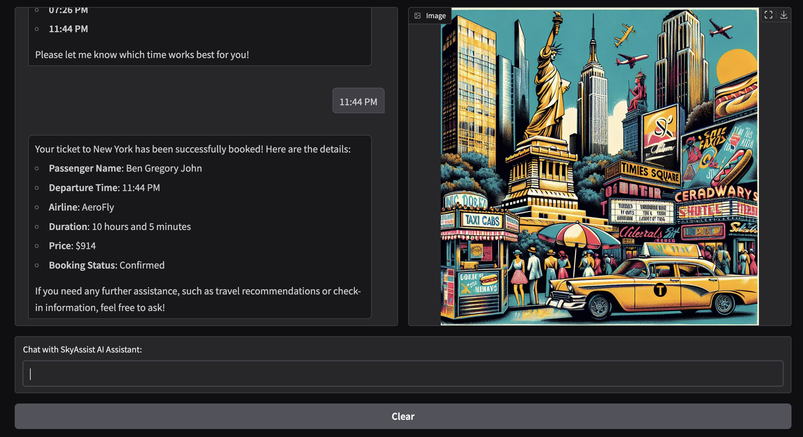

# LLM Engineering Course – Practice Files and Mini Projects

This repository contains hands-on exercises and mini projects developed as part of my learning journey through the **LLM Engineering course**. It showcases practical applications of large language models using the OpenAI API, including prompt engineering, API integration, and building useful AI-powered tools.

---

## Projects

### 1. GitHub Profile Portfolio Generator

This project generates a markdown portfolio from a GitHub profile — useful for recruiters, collaborators, or personal branding.

- **Input**: GitHub profile URL
- **Process**:
  - Extracts profile and repo page content
  - Identifies relevant links (projects, repositories)
  - Summarizes README files
- **Output**: Clean portfolio in markdown, streamed live in Jupyter
- **Tech**: OpenAI API

📄 [Notebook File](./Week%201/GitHub%20Portfolio.ipynb)

---

### 2. Adversarial Chat: GPT-4o vs. Ollama

This project simulates an adversarial conversation between OpenAI's GPT-4o-mini and a locally running Ollama model — ideal for exploring model alignment, reasoning contrast, and response style differences.

- **Input**: Custom system prompts and a seed discussion topic
- **Process**:
  - Alternates dialogue between GPT and Ollama in a turn-based format
  - Formats prompts to match OpenAI’s `messages` structure and Ollama’s raw text prompt style
  - Maintains conversation context across multiple turns
- **Output**: Structured debate transcript printed live in the notebook
- **Tech**: OpenAI API, Ollama 3.2

📄 [Notebook File](./Week%202/Convo%20Chatbots.ipynb)

---

### 3. DeutschMeister: AI German Language Coach

An interactive AI-powered German language tutor built with Gradio and OpenAI’s Chat API. It helps users learn, practice, and prepare for German exams with tailored lessons, exercises, and exam simulations based on the user's level (A1–C2) and mode (Lesson, Practice, Exam Prep).

- **Input**: User’s German proficiency level and selected mode; user questions or requests
- **Process**:
  - Uses a detailed system prompt as a professional German language educator
  - Maintains conversational context for personalized responses
  - Provides structured markdown output including grammar explanations, tables, quizzes, and encouragement
- **Output**: Interactive chat responses formatted with headings, bullet points, tables, code blocks, and quizzes
- **Tech**: OpenAI API, Gradio UI

📄 [Notebook File](./Week%202/Chatbot%20using%20Gradio.ipynb)

---

### 4. SkyAssist: Travel Companion AI
A multimodal AI-powered travel assistant built with Gradio and OpenAI's GPT-4 API. It helps users plan trips, explore destinations, and receive visually rich travel brochures through natural conversation.

- **Input**: User queries or planning needs (e.g. “Give me a travel guide to Paris”)

- **Process**:
  - Maintains conversational context using GPT-4
  - Can use to book tickets to certain destinations
  - Detects requests for travel brochures or guides and invokes a custom tool
  - Dynamically generates and displays a Markdown-rich brochure + AI image for the destination
  - Persists brochure visuals across turns 

- **Output**: Chat interface mimicking ChatGPT style, visually enhanced travel guide with headings, bullet points, and image generated via DALL·E

- **Tech**: OpenAI API (GPT-4), DALL·E 3 image generation, Gradio UI with custom styling

📄 [Notebook File](./Week%202/Multimodel%20AI%20Assistant.ipynb)

---